<h1>🏅 Olympics Data Analysis</h1>

An interactive data analysis and visualization project based on historical Olympic Games data. This project explores medal trends, country performance, sport dominance, and athlete achievements using Python and data visualization tools.

<h2>🔗 GitHub Repository:</h2>

<h2>Overview</h2>

## Initial Dashboard

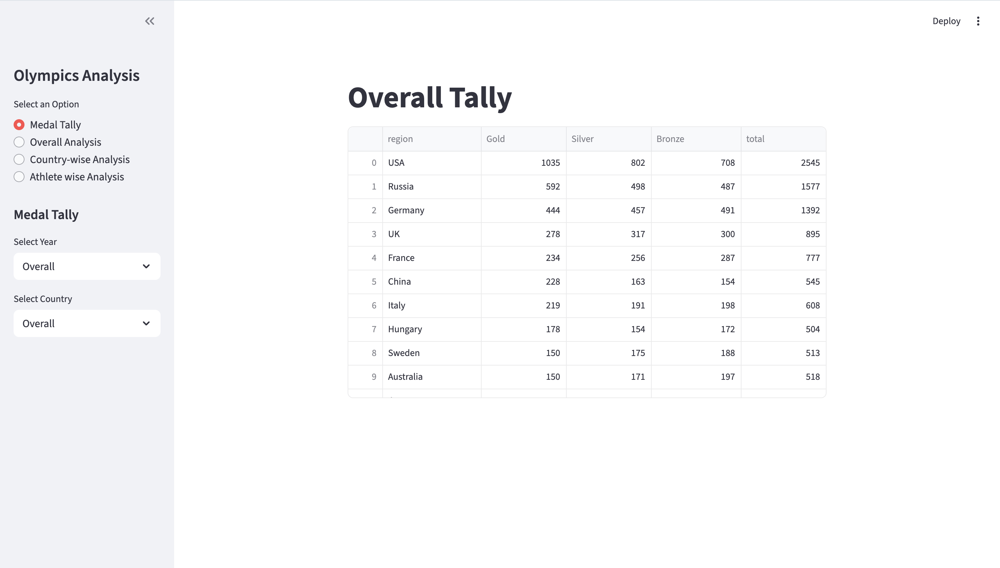

## Medal Tally (Overview dashboard)

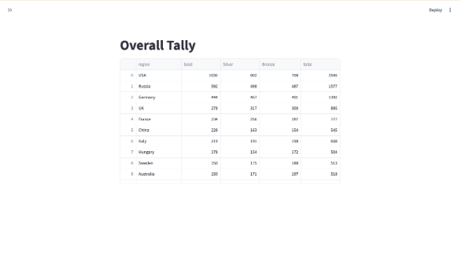

## Overall Analysis

| Top Statistics | Participating Nations Over The Years |
|------------|------------|
| 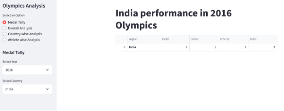 | 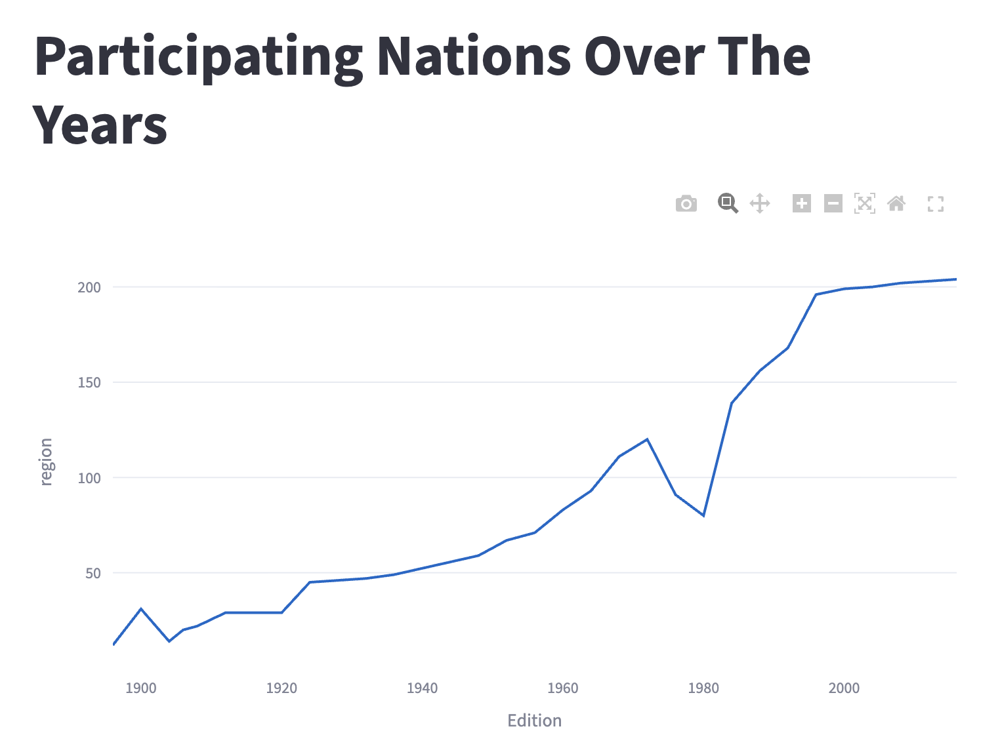 |

| Events Over The Years | Athletes Over The Years |
|------------|------------|
| 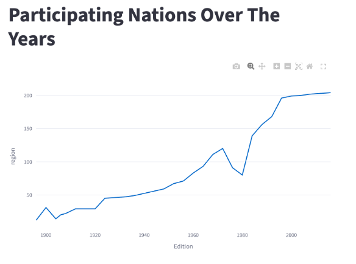 | 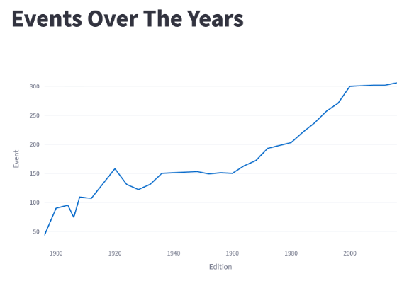 |

| Number Of Events Over Time (Every Sport) | Most Successful Athletes |
|------------|------------|
| 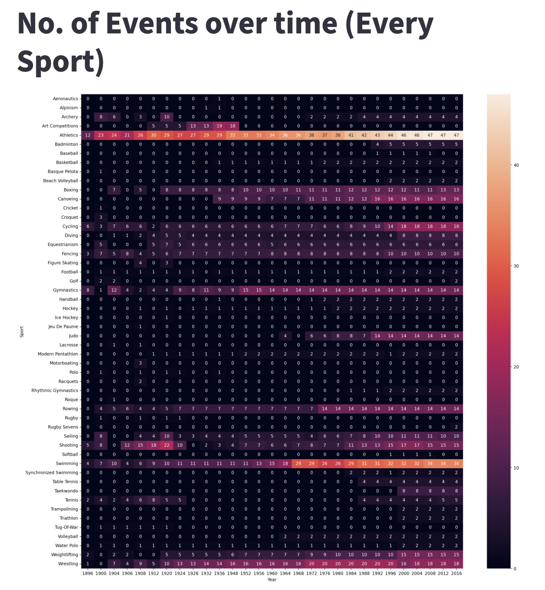 | 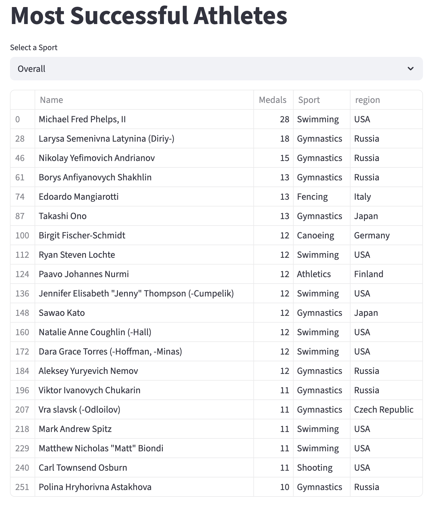 |

## Country-wise Analysis

| Medal Tally Over The Years | Top 10 Athletes |
|------------|------------|
| 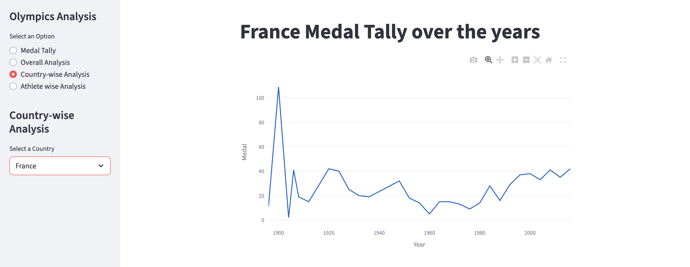 | 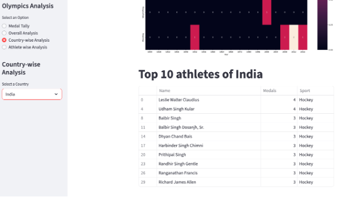 |

| Country's Excellence In Sports (Overall) |
|-------------|
| 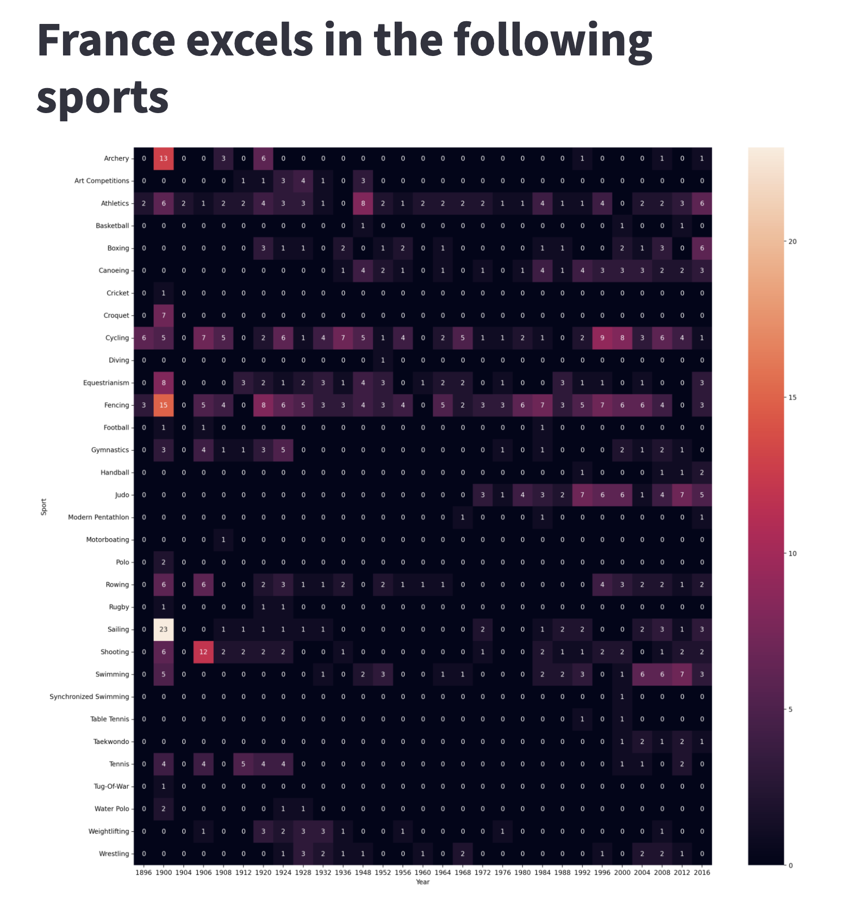 |

## Athlete-wise Analysis

| Distribution Of Age | Distribution Of Age w.r.t Sports (Gold Medalist) |
|------------|------------|
| 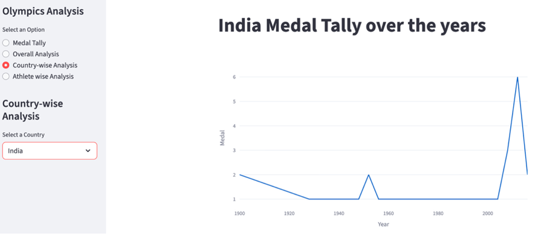 | 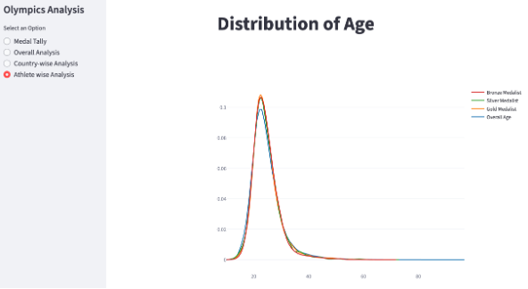 |

| Height VS Weight | Men VS Women Participation Over The Years |
|------------|------------|
| 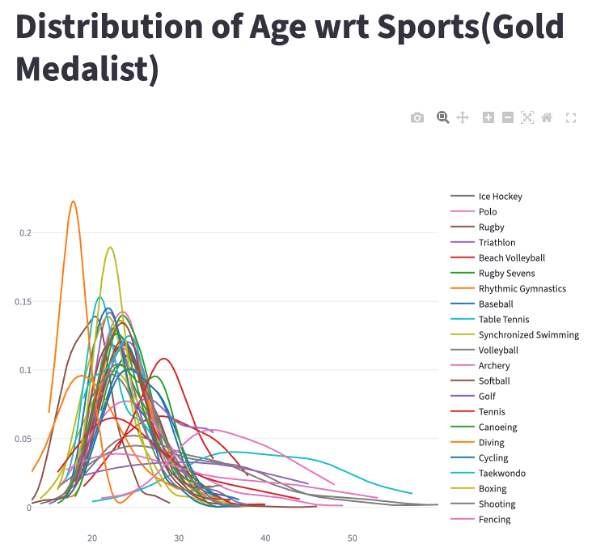 | 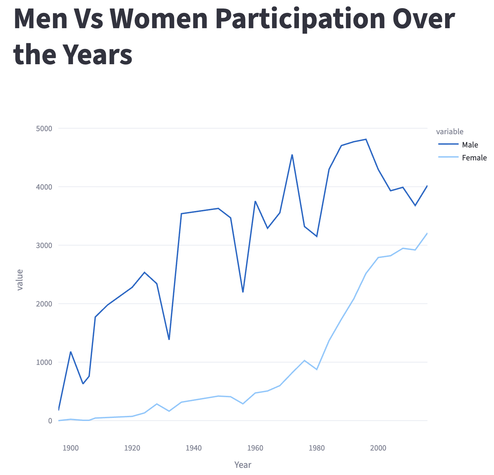 |

<h2>📌 Project Objective</h2>

The objective of this project is to analyze historical Olympic data and extract meaningful insights regarding:

+ Country-wise medal performance

+ Sport-wise medal distribution

+ Year-wise medal trends

+ Most successful athletes

+ Growth of Olympic events over time

The project also aims to build an interactive dashboard that allows dynamic filtering and visual exploration of Olympic data.

<h2>📊 Key Features</h2>

+ 🌍 Country-wise medal tally analysis

+ 🏆 Identification of most successful athletes

+ 📈 Year-wise medal trend visualization

+ 🔥 Sport-wise dominance heatmaps

+ 📊 Interactive visualizations using Plotly

+ 🖥️ Streamlit-based dashboard

<h2>🛠️ Tech Stack</h2>

🔹 Programming Language

+ Python

🔹 Data Processing

+ Pandas – Data cleaning, aggregation, pivot tables, filtering

🔹 Data Visualization

+ Matplotlib – Static visualizations

+ Seaborn – Heatmaps and statistical plots

+ Plotly Express – Interactive charts

🔹 Dashboard

+ Streamlit – Interactive web application

<h2>📂 Project Structure</h2>

```
Olympics_Data_Analysis/
│
├── app.py                # Streamlit application
├── helper.py             # Data processing functions
├── dataset/              # Olympic dataset files
├── notebooks/            # Exploratory analysis notebooks
└── README.md             # Project documentation
```

📈 Sample Insights

+ Certain countries consistently dominate specific sports.

+ Medal counts have increased over time as Olympic events expanded.

+ A small number of elite athletes contribute significantly to their nation’s medal tally.

+ Sport participation trends vary across decades.

<h2>▶️ How to Run the Project</h2>

1️⃣ Clone the repository:

```
git clone https://github.com/SIDD-1234/Olympics_Data_Analysis.git
```

2️⃣ Navigate to the project directory:

```
cd Olympics_Data_Analysis
```

3️⃣ Install dependencies:

```
pip install -r requirements.txt
```

4️⃣ Run the Streamlit app:

```
streamlit run app.py
```

<h2>📌 Conclusion</h2>

This project demonstrates how data analytics techniques can be used to transform raw historical sports data into meaningful insights. Through data cleaning, aggregation, and visualization, we can uncover trends in global sports performance and athlete achievements.

The interactive dashboard makes the analysis dynamic and user-friendly, enabling deeper exploration of Olympic data.
